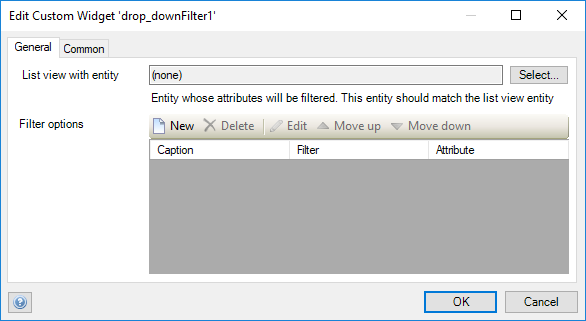
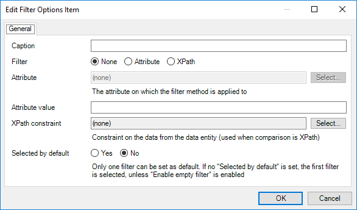
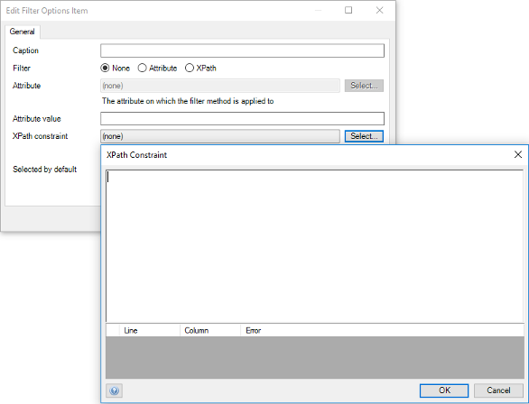

# Drop down filter
Enable users to filter a list view at run time, with various options that can be selected from a drop-down

## Features
* Filter items by an attribute
* Filter items by XPath
* Select a filter from a list of options
* Set a default filter option

## Sample

## Usage
Place the Drop-down filter widget above a list view.
Provide the entity name of the target list view in the `General` tab.

Add a new filter with a caption and choose comparison type.

When filtering by `Attribute`, select an attribute and input a value to filter by
When filtering by `XPath`, input a constraint to filter by.
`None` is for an empty option which resets the filter then selected.

**NB: The `None` filter option should always appear at the top of the list and it does not require a caption.** 
**Also to note, only one empty filter option should be selected.**

