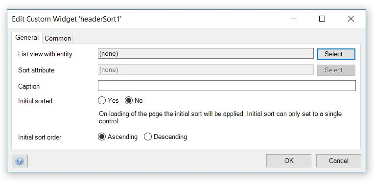

# Header sort

Add an interactive sort to your list view.
It supports sorting on a single field using headers.

## Features
* Sort through a single field
* If there is no initial sort order, the widget will always not impact the listview sort mechanism.

## Sample

## Usage

Configure the widget as below.

- On the `List view with entity` option of the `General` tab, select an entity that matches listview entity.

- On the `Sort attribute` option of the `General` tab, select an attribute to be sorted.

