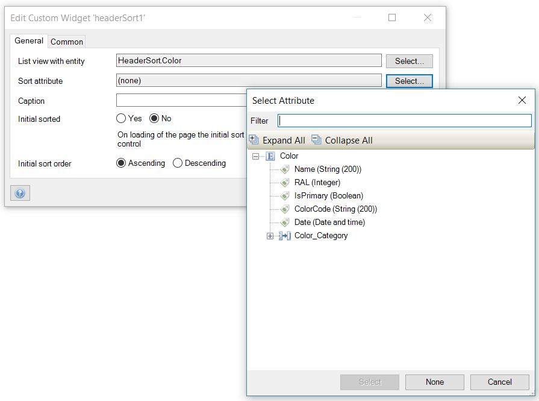

# Header sort

Add sorting behavior to the headers of a list view.
It supports sorting on a single field similar to the built-in list view sort capabilities.

## Features
* Sort through a single field.
* Click on the header to toggle the sort.

## Sample

## Usage

Configure the widget as below.

- On the `List view with entity` option of the `General` tab, select an entity that matches the target list view's entity.

- On the `Sort attribute` option of the `General` tab, select an attribute to be sorted.

- `Caption` is the header text. eg *<b>My color</b>* in the sample above.

