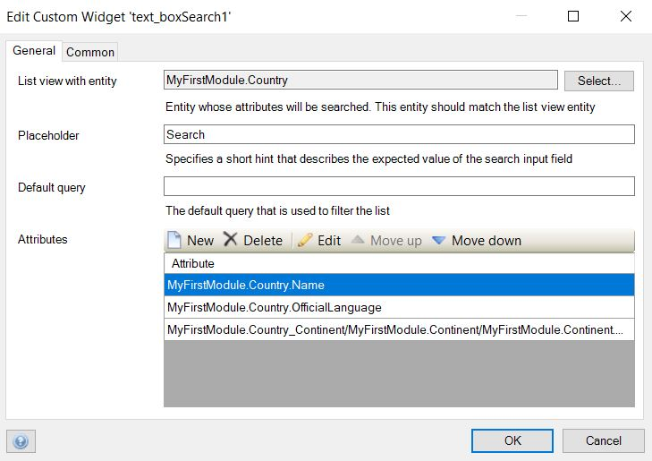
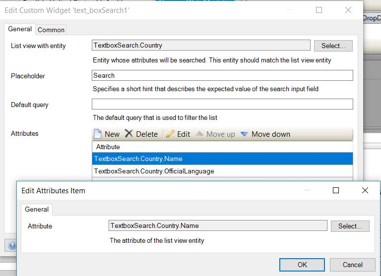

# Text-box search

Add an interactive search box to all of your list-view
It supports searching on single field similar to the built-in list view search capabilities.

## Features
* Search through a single field with single and multiple attributes
* Open search in default

## Sample

## Usage

Configure the widget as below.

- On the `List view with entity` option of the `General` tab, select an entity that matches listview entity.

- On the `Attributes` option of the `General` tab, create attributes to be used in the text search.

